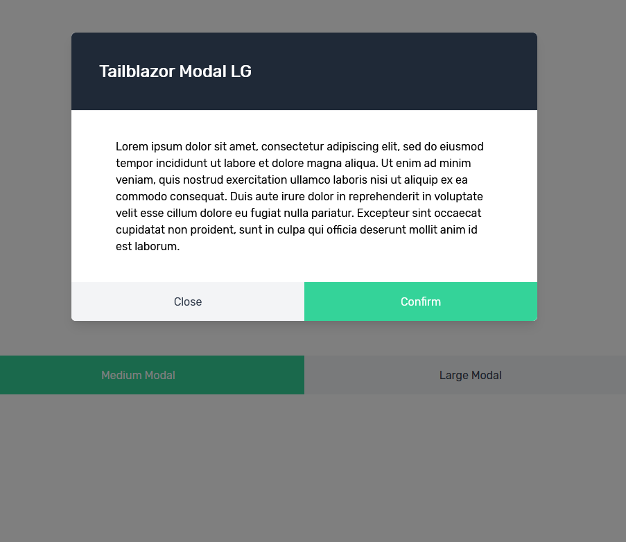

# TailBlazor.Modal
Basic Blazor Modal which can have a customizable header, body, and footer for Tailwindcss

Without passing it anything you'll get very basic styles, however giving it it's base classes and you can really make a customizable list component that Tailwind is capable of.




## Getting Setup

You can install the package via the NuGet package manager just search for TailBlazor.Modal. You can also install via powershell using the following command.

`Install-Package TailBlazor.Modal`

Or via the dotnet CLI.

`dotnet add package TailBlazor.Modal`

### 1. Add Imports

Add line to your \_Imports.razor

```
@using Tailblazor.Modal.src 
```

### 2. Create Modal Component

Simply open up a component and add your content. Sizes include Small, Medium, Large, Larger, Largest

```
<TailblazorModals IsOpen="@IsModalOpenXl" ModelWidth="TailblazorModals.Size.Largest">
    <Header>
        ...
    </Header>
    <Body>
        ...
    </Body>
    <Footer>
        ...
    </Footer>
</TailBlazorModals>
```